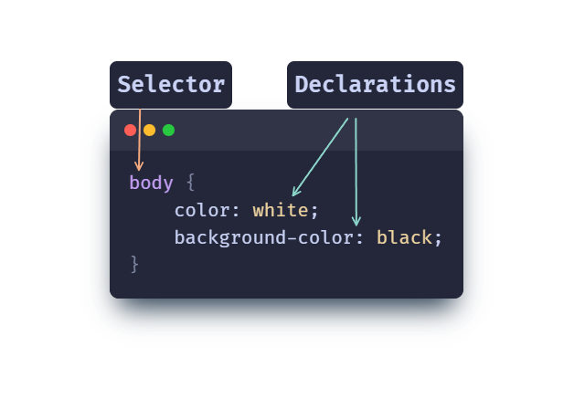

# Rules
A CSS rule is a property (or group of properties) that are applied to a specifed HTML element

- The element is targeted by the [selector](rule-selectors.md)
- These properties are set by [declarations](rule-declarations.md)

|          The anatomy of a CSS rule          |
| :-----------------------------------------: |
|  |